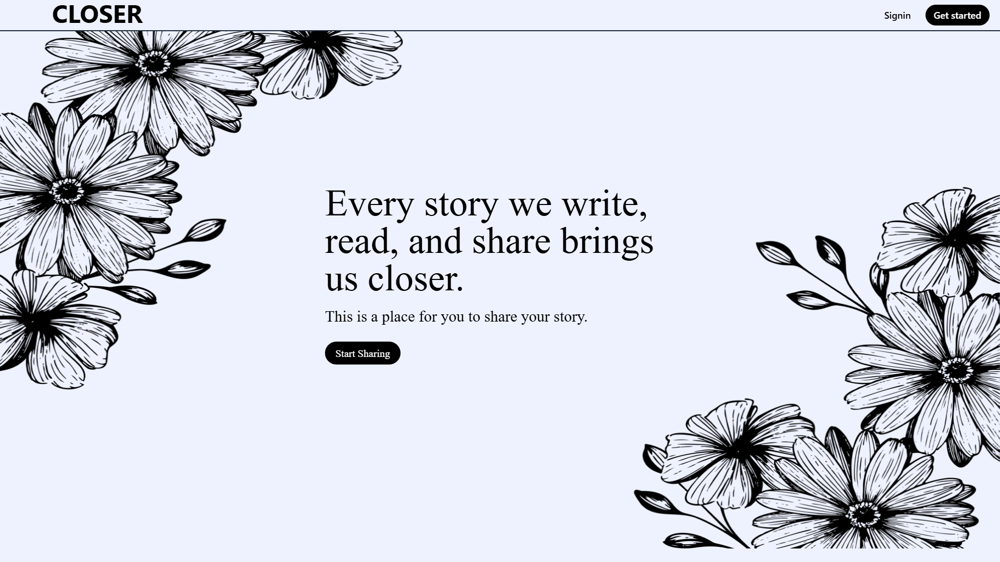
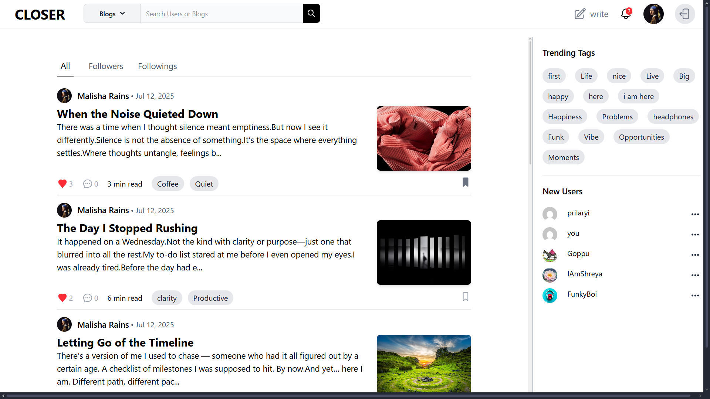
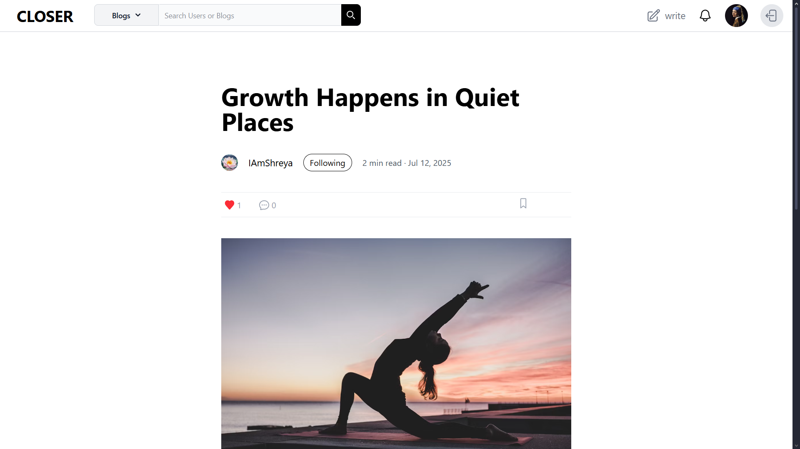
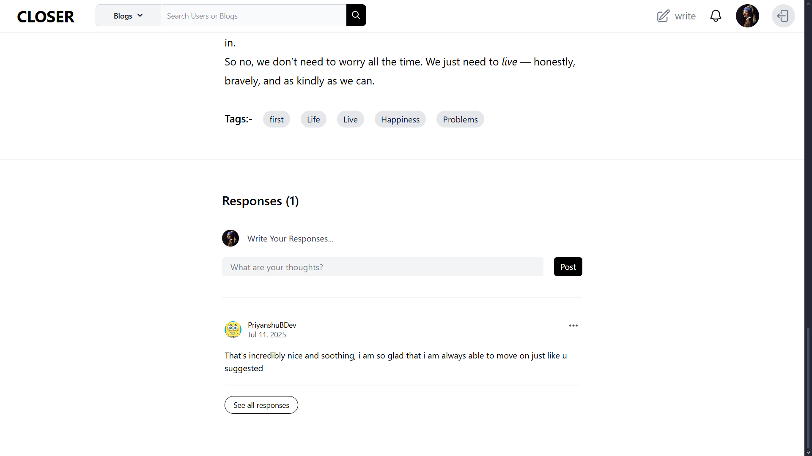
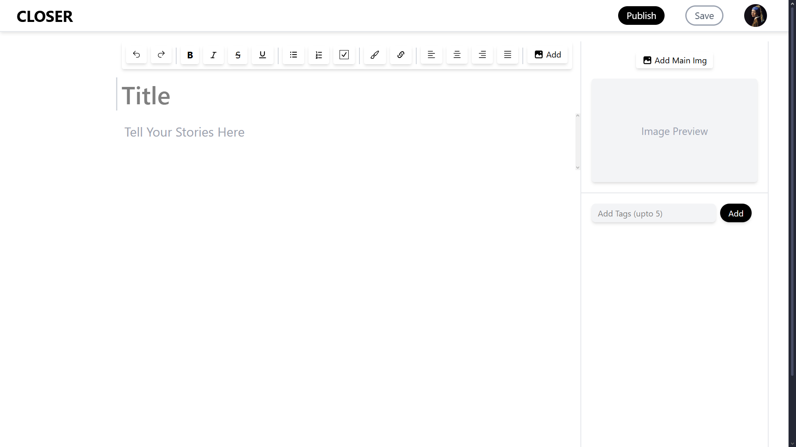
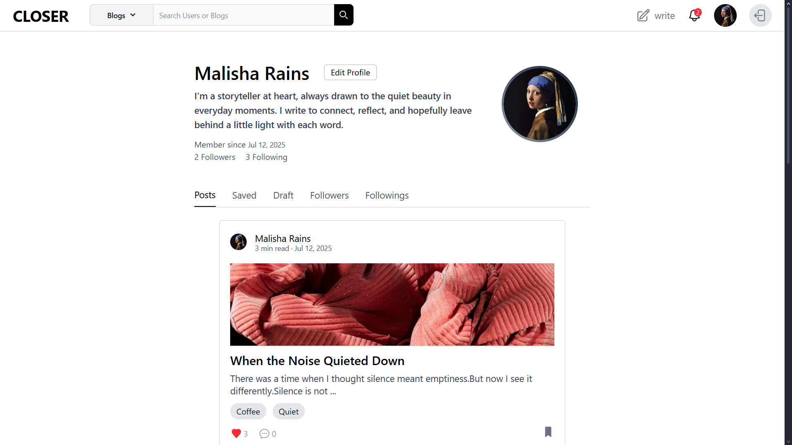
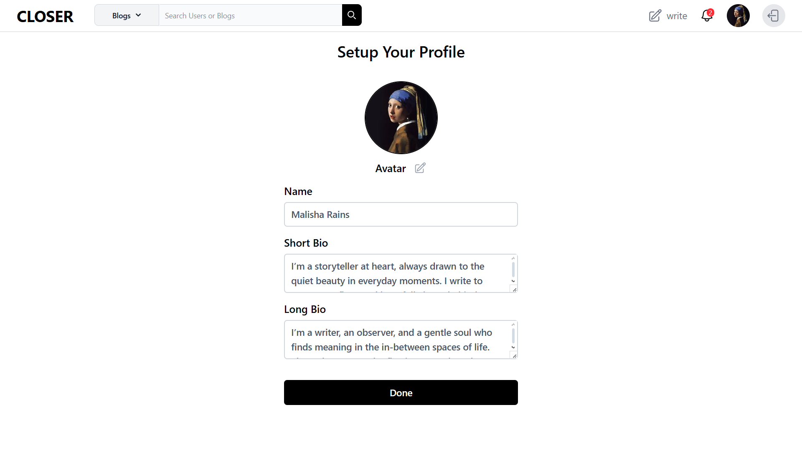
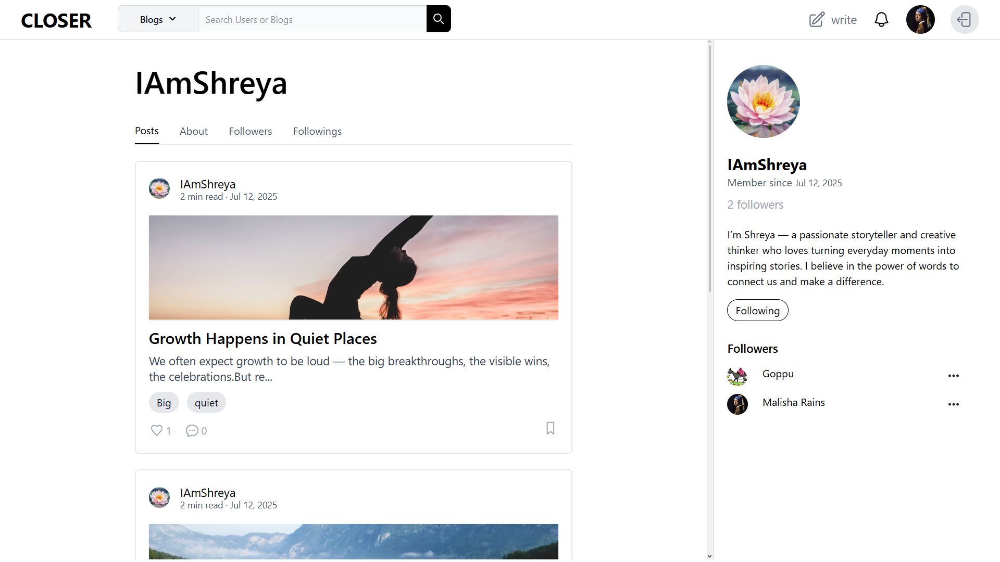
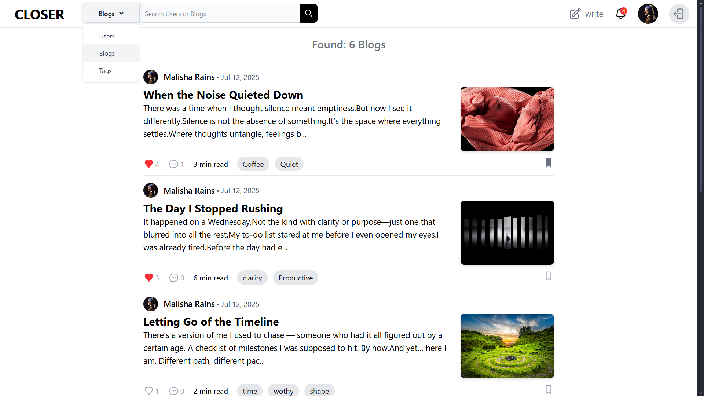
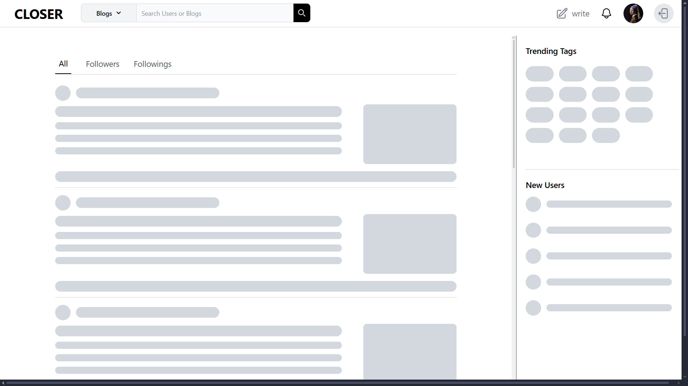

# 📝 Blogging Web App

A modern, full-featured blogging platform with a **React + TipTap** frontend and a **Hono + Prisma Accelerate** backend, built for speed, scalability, and an exceptional writing experience.

---

## 🚀 Tech Stack

### **Frontend**

- **React** (Vite + TypeScript)
- **TipTap** Rich Text Editor with:
  - Bold, italic, strike, underline
  - Lists (ordered/unordered/task)
  - Highlighting
  - Image uploads
  - Custom link popup
  - Undo/redo
- **TailwindCSS** for styling
- **React Router** for navigation
- **Axios** for API requests

### **Backend**

- **Hono** (Cloudflare Workers) – ultra-fast edge backend
- **Prisma** ORM with **Accelerate** for global query caching
- **PostgreSQL** – relational database
- **Zod** – schema validation
- **JWT Authentication** for admins
- REST API with JSON responses

---

## 📌 Features

### **Blogging**

- Read, create, update, delete blogs
- Save as draft
- Rich text formatting (TipTap powered)
- Optional cover image URL
- Many-to-many tag relationships
- Saved posts for later reading

### **Engagement**

- Like/unlike posts
- Comment on posts
- Trending tags based on activity
- Blog stats (likes, comments count)

### **Browsing**

- Paginated blog listing
- Filter by tags
- Search by keyword
- Search by username
- Author details with profile image fallback

### **Profiles**

- Public **author profile pages** (`/profile/:username`)
- User profile fields: display name, username, bio, avatar, social links, followers, followings
- Profile **edit** page for authenticated users
- Follow / unfollow other users (followers / following lists)
- View author’s posts on profile page

### **Admin**

- JWT-based secure routes
- Blog and tag management
- Input validation via Zod

## Screenshots

### Dashboard

### Homepage

### Blog

### Comments

### Editor

### Profile Page

### Profile Editor

### Others Profile

### Search

### Skeleton

---
